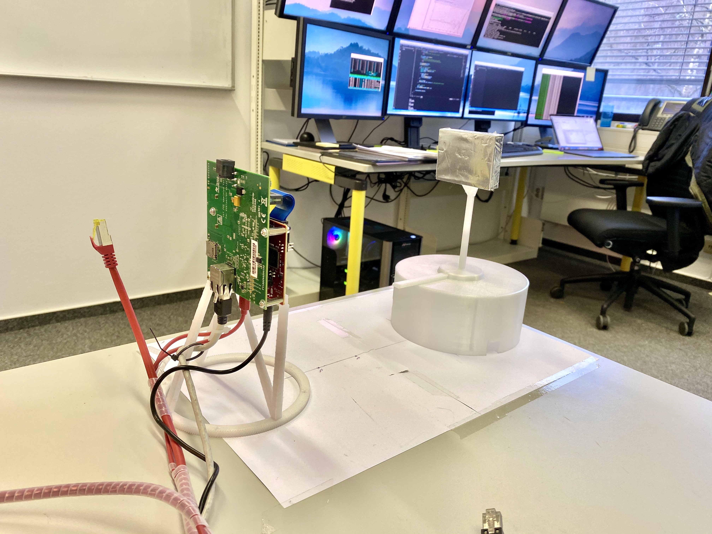

# goniometer

This was our first attempt at building a measurement device. It was inspired by [gonio-photometers](http://rgl.epfl.ch/pages/lab/pgII) that are used to measure reflection characteristics of materials for light transport simulation.

It turned out that the device itself scatters too much of the incident radar signal back to the sensor. Apart from that, the construction itself was not solid enough and the sample position ended up being too imprecise.
