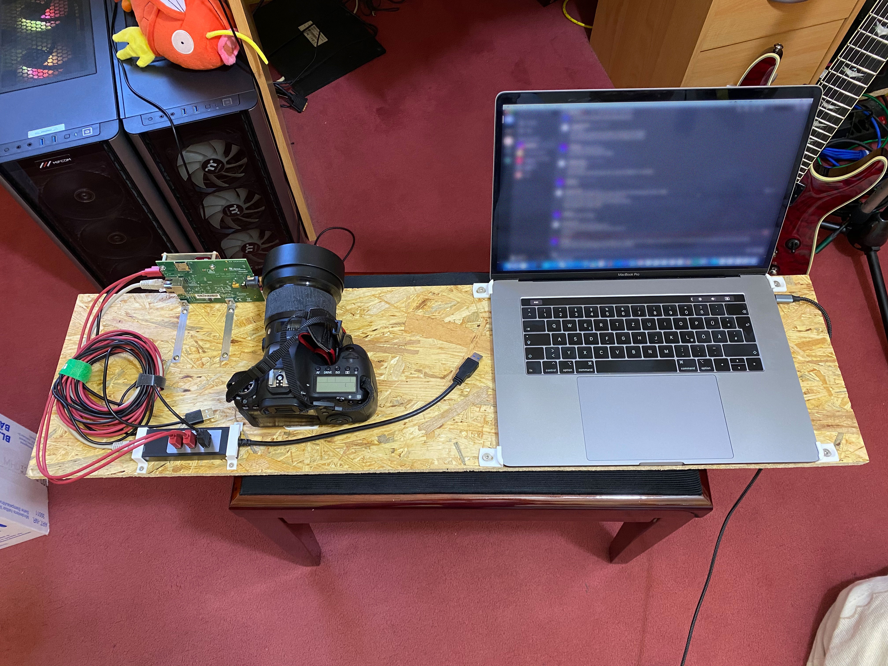

# mobile-radar

This device was constructed for mobile measurements of larger scenes.
While the other measurement devices allow us to reconstruct the captured scene digitally because they enforce a specific position and orientation of the sample, this measurement device relies on photogrammetry instead (hence the camera).
By walking around the sample (e.g. a car), snapshots of the radar cube and view of the camera are taken.
Using the photos from the camera, we can reconstruct the 3d geometry of the scene and the position and orientation from which the photos (and hence the radar measurements) were taken.
For our experiments, we have used [Agisoft MetaShape](https://www.agisoft.com/features/professional-edition/).
