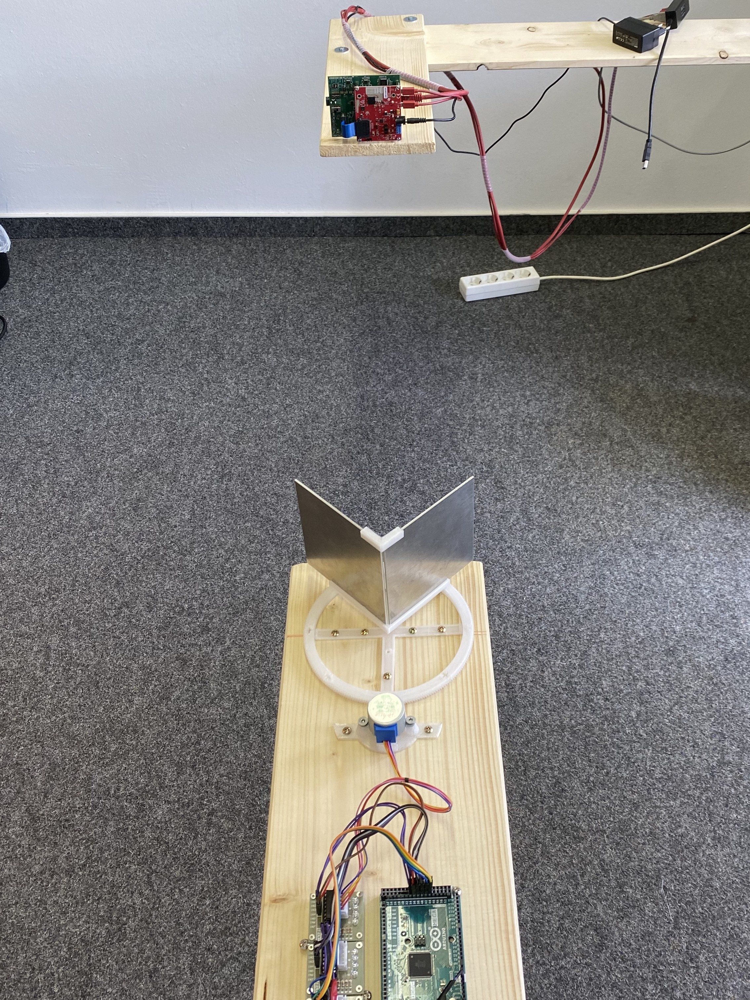

# office

After our first attempt at building a measurement device, we learned that minimizing radar backscatter from the device itself is crucial to obtain accurate measurements. Since we were not able to obtain radar absorbant materials, we needed to keep everything apart from the sample itself out of proximity of the radar. Hence the separate wooden planks, which allow us to obtain a gap between the radar and all other objects (floor, walls, ceiling and the plank that holds the measurement device).

This is the setup we have used to capture the measurements of different dihedral reflectors.

Note that this setup is far from perfect as well:
there is still some backscatter from the front-side of the wooden plank as well as the servo motor and Arduino.
However, the bigger problem was getting both wooden planks aligned precisely, as wood tends to warp slightly.
A metal construction (something like an optical table) would be ideal to enforce a precise alignment, but have the disadvantage that they interfer more strongly with the measurement and need proper treatment with radar absorbant materials.
