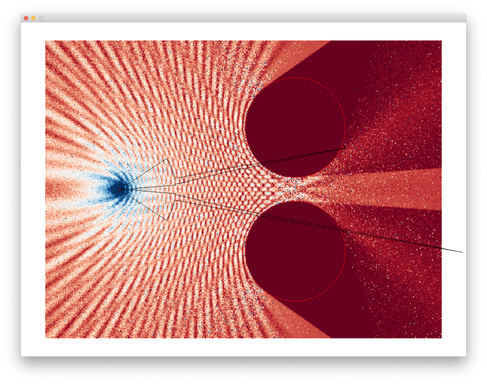

# hussar2d

This application is a smaller version of the `libhussar` library, but carries out simulations in two dimensions instead of three.
It can serve as playground to experiment with research ideas, as those can often times be more easily verified in two dimensions before they are evaluated in a full three-dimensional setting.
In particular, performing experiments in two dimensions allows us to compare against full wave solvers such as [meep](https://meep.readthedocs.io/en/latest/) (a FDTD solver) in reasonable time, while performing similar reference simulations in three dimensions might take months or even years to complete.

## Differences to libhussar
As opposed to `libhussar`, this subproject is not only a library, but also contains a visualizer based on [SDL2](https://libsdl.org). Since `hussar2d` only serves as minimalistic playground to verify ideas, it only supports a subset of the features of `libhussar`.

### What is supported
* Intersection with circles and axis-aligned rectangles
* Visualization of field strength and phase throughout space
* Path tracing for Radar simulation (similar to `libhussar`)

Note that since the integration domain is significantly smaller in two dimensions, `hussar2d` can actually use physical optics for _all_ scattering events in the ray path instead of just the last vertex like in `libhussar`. This can lead to more accurate simulation results, however, at the expense of longer computation times.

### What is not supported
* Intersection with triangles is not supported
* Simulations cannot be carried out on GPU
* Low discrepancy sampling is not supported
* Simulation data cannot be exported
* No simulation of the FMCW signal chain
* Only point emitters supported

## Installation
This application uses CMake as build system. A compiler with support for the C++20 standard is required. The following dependencies need to be installed:

* SDL2
* Eigen3
