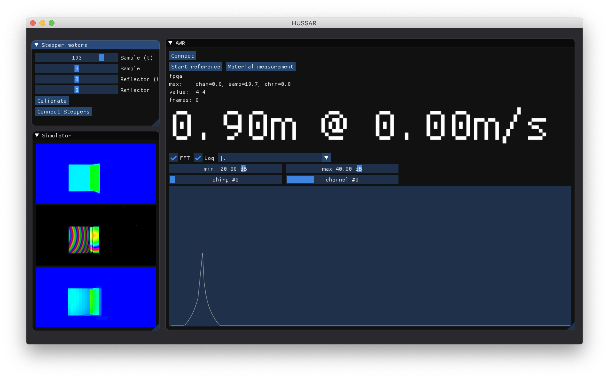

# visualizer

`visualizer` provides a graphical user interface to do experiments with both data capture (using [`libawrcapture`](../libawrcapture)) and simulation (using [`libhussar`](../libhussar)).
It also contains code to interface with the stepper motors attached to the Arduino in our measurement device.

## Installation
This library uses CMake as build system and requires a C++20 capable compiler. Since the underlying dependencies vary between platforms, we can not guarantee that this library will compile on all platforms. It has only been tested on macOS 10.15 and Ubuntu 18 so far, there is no support for Windows yet.

### Dependencies
We require the following packages to be installed.

| Package | Example command using apt   |
|---------|-----------------------------|
| Eigen3  | `apt install libeigen3-dev` |
| glfw3   | `apt install libglfw3-dev`  |

The following dependencies are optional, but recommended:

| Package | Purpose | Installation |
|---------|---------|--------------|
| fftw3   | Allows FFT transform of captured Radar data | `apt install libfftw3-dev` |
| embree3 | Required for simulations on CPU | [Installation instructions](https://www.embree.org/downloads.html) |

### Compiler
Make sure your compiler supports `#include <filesystem>`.
For GCC, this requires **g++-8** to be installed, which you can configure to be used in CMake by passing `-DCMAKE_CXX_COMPILER=g++-8` to `cmake`.

## Device setup
@todo describe steps to be taken in mmWave Studio
